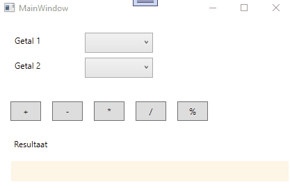

# Lussen en collecties : oefening 1  

Nadat je de code hebt binnengehaald bestudeer je eerst even de controls die zich op het venster beginnen zodat je weet welke controls er zijn en hoe ze heten.  

Vooraleer je begint te programmeren, bekijk aandachtig deze korte demo : 

  

Tijdens de opstart van je programma die je de 2 comboboxen te vullen met getallen van 1 tot en met 100.  
Wanneer op "+" wordt geklikt, dan dienen beide getallen uitgelezen te worden en het resultaat van de optelling dient afgebeeld te worden.  Indien in één van de comboboxen nog geen getal werd geselecteerd dan toon je dit aan de gebruiker.  
Wanneer op "-" wordt geklikt, dan dienen beide getallen uitgelezen te worden en het resultaat van de aftrekking dient afgebeeld te worden.  Indien in één van de comboboxen nog geen getal werd geselecteerd dan toon je dit aan de gebruiker.  
Wanneer op "*" wordt geklikt, dan dienen beide getallen uitgelezen te worden en het resultaat van de vermenigvuldiging dient afgebeeld te worden.  Indien in één van de comboboxen nog geen getal werd geselecteerd dan toon je dit aan de gebruiker.  
Wanneer op "/" wordt geklikt, dan dienen beide getallen uitgelezen te worden en het resultaat van de deling dient afgebeeld te worden.  Indien in één van de comboboxen nog geen getal werd geselecteerd dan toon je dit aan de gebruiker.  
Wanneer op "%" wordt geklikt, dan dienen beide getallen uitgelezen te worden en het resultaat van de restbepaling dient afgebeeld te worden.  Indien in één van de comboboxen nog geen getal werd geselecteerd dan toon je dit aan de gebruiker.  

Wordt een andere waarde gekozen in 1 van beide comboboxen, dan dient het label onderaan leeggemaakt te worden.

